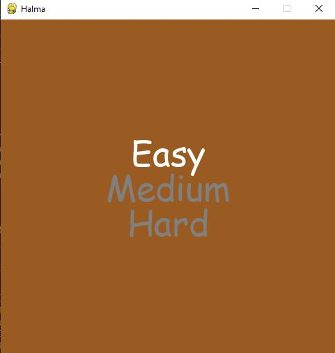
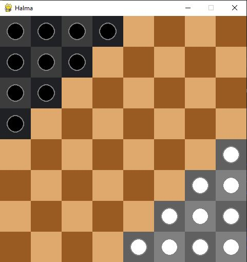

# Halma Game with AI

A Python implementation of the classic Halma board game with an AI opponent using the minimax algorithm with alpha-beta pruning.

## Overview

This project is a complete implementation of the Halma board game, featuring:

- A graphical user interface built with Pygame
- Three AI difficulty levels (Easy, Medium, Hard)
- Optimized minimax algorithm with alpha-beta pruning
- Customizable board size and appearance

## Game Rules

Halma is a strategy board game where players try to move all their pieces across the board to the opponent's starting area. The game is played on an 8×8 board with the following rules:

1. Players take turns moving one piece per turn
2. Pieces can move to any adjacent empty square
3. Pieces can jump over other pieces (both friendly and opponent's) to an empty square
4. Multiple jumps are allowed in a single turn
5. The first player to move all their pieces to the opponent's starting area wins

## Demo Video
[Watch the demo video here](https://go.screenpal.com/watch/cThQbZnQ5Kn)

## Project Report

[Watch the project report](report&proposal/project-report.pdf)

### Prerequisites

- Python 3.6 or higher
- Pygame library

### Setup

1. Clone the repository:
   \`\`\`
   git clone https://github.com/HK-huzaifa-khan/halma-game.git
   cd halma-game
   \`\`\`

2. Install the required dependencies:
   \`\`\`
   pip install pygame
   \`\`\`

3. Run the game:
   \`\`\`
   python main.py
   \`\`\`

## How to Play

1. Launch the game by running `main.py`
2. Select an AI difficulty level (Easy, Medium, Hard) using the arrow keys and Enter
3. You play as the Black pieces (bottom left), and the AI controls the White pieces (top right)
4. Click on a piece to select it, then click on a highlighted square to move
5. The goal is to move all your pieces to the opponent's starting area before the AI does the same

## Project Structure

- `main.py`: Entry point and game loop
- `halma/`
  - `constants.py`: Game constants and configuration
  - `piece.py`: Piece class implementation
  - `board.py`: Board representation and logic
  - `game.py`: Game state and rules
- `minimax/`
  - `algorithm.py`: AI implementation using minimax with alpha-beta pruning

## AI Implementation

The AI uses the minimax algorithm with alpha-beta pruning to determine the best move. The evaluation function considers:

1. The distance of each piece to the opponent's starting zone
2. The number of pieces in the opponent's starting zone
3. A penalty for pieces still in their own starting zone

The AI difficulty levels correspond to different search depths in the minimax algorithm:
- Easy: 1 level deep
- Medium: 2 levels deep
- Hard: 3 levels deep

## Performance Optimizations

Several optimizations have been implemented to improve the AI's performance:

1. Alpha-beta pruning to reduce the number of nodes evaluated
2. Move ordering to improve pruning efficiency
3. Time limit to prevent the AI from thinking too long
4. Evaluation function caching to avoid redundant calculations

## Future Improvements

Potential enhancements for future versions:

- Network multiplayer support
- Additional AI algorithms (Monte Carlo Tree Search, Neural Networks)
- Game state saving/loading
- Customizable piece colors and board themes
- Tutorial mode for new players

## License

This project is licensed under the MIT License - see the LICENSE file for details.

## Acknowledgments

- The classic Halma board game for the inspiration
- Pygame library for making the GUI implementation straightforward
